# Práctica Mejora Proyecto Cliente con Github Actions

## Tecnologías

#### GitHub

Una de las principales plataformas para crear proyectos abiertos de herramientas y aplicaciones, y se caracteriza sobre todo por sus funciones colaborativas que ayudan a que todos puedan aportar su granito de arena para mejorar el código.

#### GitHub Actions

Permite crear flujos de trabajo (workflows) que se pueden utilizar para compilar, probar y desplegar código, dando la posibilidad de crear flujos de integración y despliegue continuo dentro del propio repositorio de git.

#### Surge

Surge es una plataforma en la nube para alojar sitios web estáticos, que es extremadamente sencilla de utilizar pero que ofrece opciones de personalización para quienes las necesiten.

## Procedimiento de la practica

### Aspectos generales del workflow

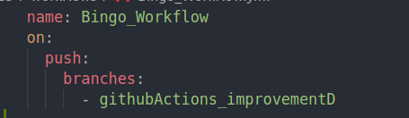

El nombre del workflow es Bingo_Workflow y se ejecutará cada vez que se hace un push en la rama "githubActions_improvementD". Todos los jobs se ejecutan en una máquina ubuntu.

### Jobs

#### syntax_check_job

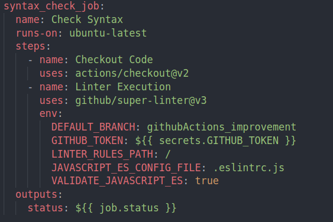

##### Función del job

Este job será el encargado de comprobar la sintaxis de los distintos archivos javascript para seguir con una misma metodología de nomenclatura para todos los integrantes del equipo.

##### Steps

- Descarga de código
- Establecer el uso del linter que nos proporciona github con sus variables de entorno, se establece la rama, la dirección raíz donde se encuentra el archivo de configuración slint, el nombre del archivo y por último se pide que valide el javascript.

##### Output

La salida del workflow determinará si el job ha sido exitoso o no

##### Archivos de configuración

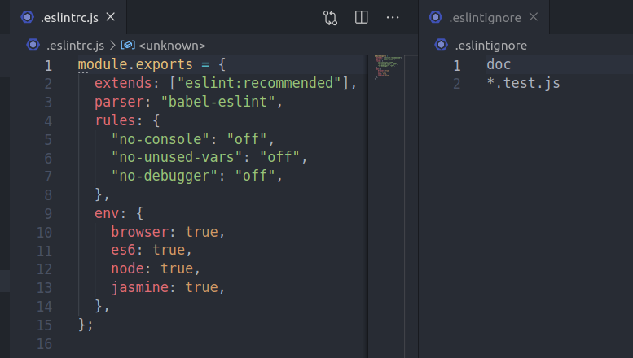

#### test_execution_job

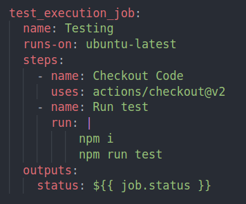

##### Función del job

Este job tendrá como objetivo la ejecución de los tests del proyecto.

##### Steps

- Descargarse el código
- Instalación de las dependencias del proyecto y ejecutar el comando que inicia los tests.

##### Output

La salisa de este job será el estado de la finalización del job.

##### Archivos de los tests

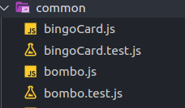

#### build_statics_job

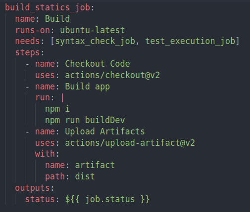

##### Función del job

La finalidad de este job es la creación de los archivos estáticos para el posterior despliegue. 

##### Steps

- Descarga de código
- Instalación de las dependencias del proyecto, creación de los estáticos con el comando npm build y construcción del proyecto con el comando npm run buildDev
- Deposita los artefactos generados por la compilación en el directorio dist

##### Output

Resultado del job.

#### deploy_job

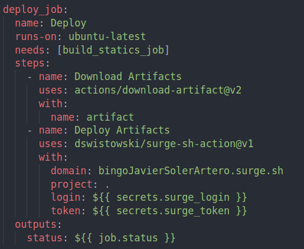

##### Función del job

Será el encargado de cojer los archivos generados por el job anterior y una vez listos para su compilación hará el despliegue en el dominio bingoJavierSolerArtero.surge.sh grácias a la herramienta previamente explicada surge.sh

##### Steps

- Descargará los artifacts creados y subidos previamente a este job
- Usando la custom action que nos facilita surge.sh, nos permitirá desplegar la app usando las variables de entorno donde le especificaremos, el dominio, la ruta del proyecto y nuestras credenciales (guardadas previamente en los secrets de este mismo repositorio)

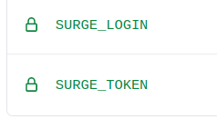

##### Output

La salida del job será el estado final del job y como ha sido finalizado.

#### job

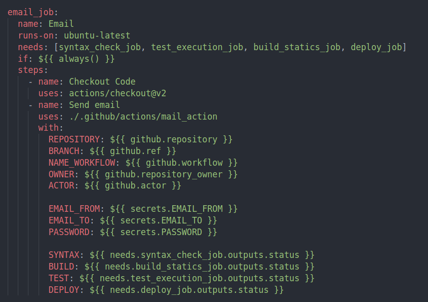

##### Función del job

Este job realizará el envío de un email a un destinatario una vez se ha hecho un push en la rama actual. Este job se ejecutará una vez se han ejecutado los cuatro anteriores y se enviará igualmente independientemente de su estado de finalización.

##### Steps

- Descarga de código
- Envio de email usando la custom action creada en el directorio actions/mail_action. Donde se establecen valores de entrada para github como información del repositorio y del commit subido, datos necesarios para el envio del email (correo de destino, correo de origen y contraseña) y por último el estado de la ejecución de los jobs previos.

- Custom Action: 

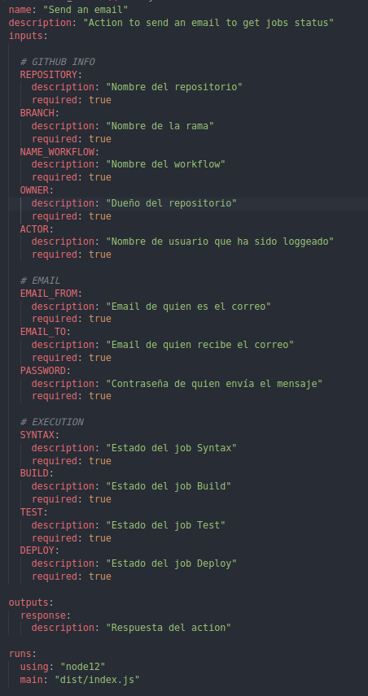

Esta es la custom action, donde se declaran todos los valores de entrada, salida y que y como se ejecutará el action.
Como podemos observar están todos los valores de entrada y salida que se han comentado previamente para la notificación del workflow mediante un correo electrónico y se finalizará con un output que notificará el resultado de la action.

- index.js:

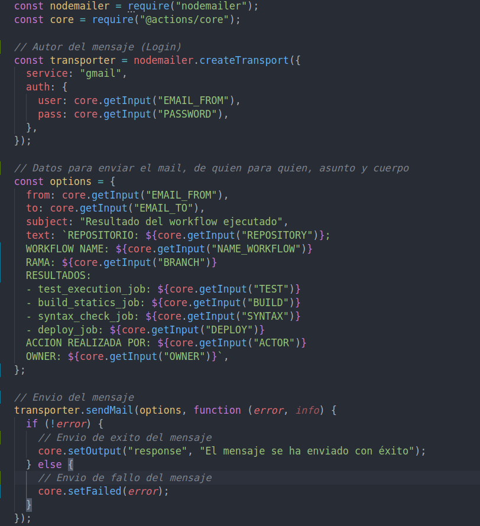

Como se puede observar en la previa imagen se importan las librerias que se necesitan para la creación del mensaje. Se loguea el autor que va a hacer el mensaje, se crea el mensaje (origen, destino, asunto y cuerpo).

#### job

##### Función del job

##### Steps

##### Output

